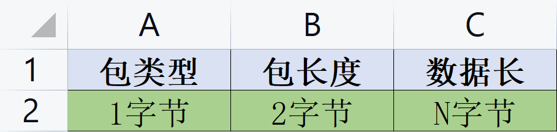

# Sensor Server
## 简介
Sensor Server： 这是一个用 C 实现的传感器数据采集 TCP Based 服务器案例, 该项目主要用来学习TCP编程，实际上并没有生产力。不过你要是驾驭了epoll，玩这个简直小菜一碟.

## 协议规范
### 报文格式
数据报文格式非常简单，类型1字节，长度2字节，数据N字节：
    </img>

### 报文列表

| 类型 | 名称         | 说明                         |
| ---- | ------------ | ---------------------------- |
| 0x00 | PING         | 心跳 PING                    |
| 0x01 | PING_OK      | 心跳回包: 0, 超时时间5s      |
| 0x02 | CONN         | 请求连接 CONN                |
| 0x03 | CONN_ACK     | 连接回复: 0x0-成功；0x1-失败 |
| 0x04 | DIS_CONN     | 请求断开 CONN                |
| 0x05 | DIS_CONN_ACK | 断开回复: 0x0-成功；0x1-失败 |
| 0x06 | SEND         | 发送数据                     |
| 0x07 | SEND_ACK     | 发送回复: 0x0-成功；0x1-失败 |
| 0x08 | PUBLISH      | 发布数据:                    |
| 0x09 | PUBLISH_ACK  | 发布回复: 0x0-成功；0x1-失败 |

## 测试代码
可用根目录下的 `test.erl` 里面的代码测试，当然前提是你得会erlang。